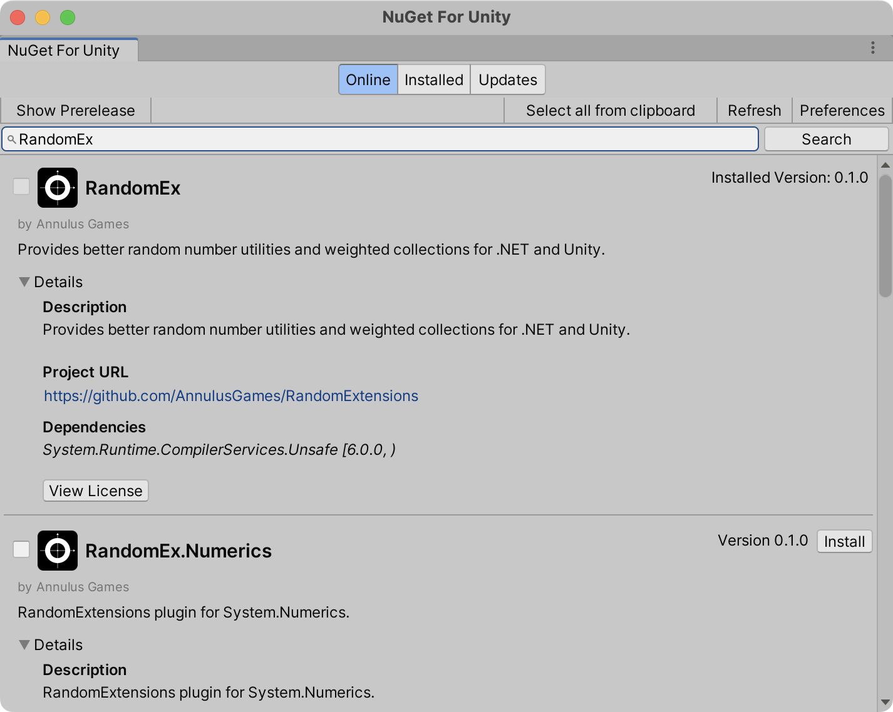

# Random Extensions

[](https://www.nuget.org/packages/RandomEx)
[](https://github.com/AnnulusGames/RandomExtensions/releases)
[](./LICENSE)

English | [日本語](README_JA.md)

## Overview

Random Extensions is a library that provides functionality for pseudorandom number generation for .NET and Unity.

.NET has a built-in `Random` class, but it is not sufficient in terms of functionality and contains complex implementations and unnecessary abstractions due to compatibility issues.

Unity's `UnityEngine.Random` is a static class, making it impossible to instantiate. Additionally, it manages internal states, making it difficult to reproduce random numbers.

Random Extensions introduces `IRandom` as a new abstraction layer for random number generation, providing high performance implementations based on various algorithms (xoshift, xoshiro, splitmix, PCG). It also offers many useful features for handling random numbers, such as extension methods that support `System.Numerics` and Unity types, `IWeightedCollection<T>` for handling weighted random numbers, and LINQ extensions for random numbers (`RandomEnumerable`).

> [!WARNING]
> Do not use this library for security purposes. If you need cryptographically secure random numbers, use `System.Security.Cryptography.RandomNumberGenerator`.

## Installation

### NuGet packages

Random Extensions requires .NET Standard 2.1 or higher. The package is available on NuGet.

### .NET CLI

```ps1
dotnet add package RandomEx
```

### Package Manager

```ps1
Install-Package RandomEx
```

### Unity

You can use Random Extensions in Unity by using NugetForUnity. For more details, refer to the [Unity](#unity-1) section.

## Basic Usage

You can generate random numbers using `RandomEx.Shared`.

```cs
using RandomExtensions;

// Get a random value between 0-9
var n = RandomEx.Shared.NextInt(0, 10);

// Get a random boolean value
var flag = RandomEx.Shared.NextBool();
```

You can also create an instance of `IRandom` initialized with a random seed using `RandomEx.Create()`.

```cs
// Create an instance
var rand = RandomEx.Create();

// Get a random value in the range [0.0, 1.0)
var d = rand.NextDouble();
```

> [!WARNING]
> Please note that `RandomEx.Shared` is thread-safe, but instances created with `RandomEx.Create()` or other classes implementing `IRandom` are not thread-safe.

## Supported Types

Random Extensions supports more types than the standard `System.Random`.

```cs
var rand = RandomEx.Create();

// int
rand.NextInt();                 // [int.MinValue, int.MaxValue]
rand.NextInt(10);               // [0, 10)
rand.NextInt(10, 20);           // [10, 20)

// uint
rand.NextUInt();                // [0, uint.MaxValue]
rand.NextUInt(10);              // [0, 10)
rand.NextUInt(10, 20);          // [10, 20)

// long
rand.NextLong();                // [long.MinValue, long.MaxValue]
rand.NextLong(10);              // [0, 10)
rand.NextLong(10, 20);          // [10, 20)

// ulong
rand.NextULong();               // [0, ulong.MaxValue]
rand.NextULong(10);             // [0, 10)
rand.NextULong(10, 20);         // [10, 20)

// float
rand.NextFloat();               // [0f, 1f)
rand.NextFloat(10f);            // [0f, 10f)
rand.NextFloat(10f, 20f);       // [10f, 20f)

// double
rand.NextDouble();              // [0.0, 1.0)
rand.NextDouble(10.0);          // [0.0, 10.0)
rand.NextDouble(10.0, 20.0);    // [10.0, 20.0)
rand.NextDoubleGaussian();      // Get a random value following a Gaussian distribution with a mean of 0.0 and a standard deviation of 1.0

// byte[], Span<byte>
rand.NextBytes(buffer);          // Fill the buffer with random bytes
```

Additionally, by introducing the extension package, you can use methods that support types in `System.Numerics` and Unity. For details, see the sections on [System.Numerics](#systemnumerics) and [Unity](#unity-1).

## Collection Operations

### Element Retrieval

You can use the `GetItem()` method to retrieve a random element from an array. If you want to retrieve multiple elements at once, use `GetItems()`.

```cs
var rand = RandomEx.Create();

// Create an array of values
var values = new int[] { 0, 1, 2, 3, 4, 5, 6, 7, 8, 9 };

// Get a random element
var item = rand.GetItem(values);

// Get 5 random elements (with duplicates)
var items = rand.GetItems(values, 5);
```

You can also specify weights for each element. The array of weights you pass as an argument must match the number of elements in the original array.

```cs
var values = new int[] { 0, 1, 2 };
var weights = new double[] { 1.0, 5.0, 1.0 };

// Retrieve weighted random elements
var item = rand.GetItem(values, weights);
var items = rand.GetItem(values, weights, 5);
```

### Shuffling

You can shuffle the elements of an array using the `Shuffle()` method.

```cs
var array = new int[] { 0, 1, 2, 3, 4, 5 };

// Shuffle the array elements
rand.Shuffle(array);
```

This method modifies the array itself. If you need a side-effect-free shuffle, use the following LINQ extension.

### LINQ Extensions

Under the `RandomExtensions.Linq` namespace, there are LINQ extensions that utilize random numbers.

```cs
using System;
using System.Linq;
using RandomExtensions.Linq;

var sequence = Enumerable.Range(0, 100);

// Get a random element
var r = sequence.RandomElement();

// Shuffle the order
foreach (var item in sequence.Shuffle())
{
    Console.WriteLine(item);
}

// Create an IEnumerable<T> that yields random values in the range [0, 9] 10 times
foreach (var item in RandomEnumerable.Repeat(0, 10, 10))
{
    Console.WriteLine(item);
}
```

These methods can take an `IRandom` instance for random number generation. If not specified, `RandomEx.Shared` will be used.

```cs
var rand = RandomEx.Create();

// Get elements using the passed rand instance
var r = sequence.RandomElement(rand);
```

## Weighted Collections

Under the `RandomExtensions.Collections` namespace, there are collections that hold weighted elements.

```cs
// Interface for a weighted collection
public interface IWeightedCollection<T> : IReadOnlyCollection<WeightedValue<T>>
{
    T GetItem<TRandom>(TRandom random) where TRandom : IRandom;
    void GetItems<TRandom>(TRandom random, Span<T> destination) where TRandom : IRandom;
}

// Struct representing a weighted element
public readonly record struct WeightedValue<T>(T Value, double Weight);
```

Below is a sample of using `WeightedList<T>` for weighted selection.

```cs
// Create a weighted list
var weightedList = new WeightedList<string>();

// Add elements with specified weights
weightedList.Add("Legendary", 0.5f);
weightedList.Add("Epic", 2.5f);
weightedList.Add("Rare", 12f);
weightedList.Add("Uncommon", 25f);
weightedList.Add("Common", 60f);

// Retrieve a weighted random element
var rarity = weightedList.GetItem();
```

## IRandom

Random Extensions provides `IRandom` as an interface for random number generators. By implementing this interface, you can create custom random number generator.

```cs
public interface IRandom
{
    void InitState(uint seed);
    uint NextUInt();
    ulong NextULong();
}
```

### IRandom Implementations

Random Extensions provides several `IRandom` implementations by default. Below is a list of class names and the pseudorandom number algorithms they use internally.

| Class Name | Algorithm |
| - | - |
| `Pcg32Random` | PCG32 (PCG-XSH-RR) |
| `SplitMix32Random` | splitmix32 |
| `SplitMix64Random` | splitmix64 |
| `Xorshift32Random` | xorshift32 |
| `Xorshift64Random` | xorshift64 |
| `Xorshift128Random` | xorshift128 |
| `Xoshiro128StarStarRandom` | xoshiro128** |
| `Xoshiro256StarStarRandom` | xoshiro256** |

## RandomExtensions.Algorithms

Under the `RandomExtensions.Algorithms` namespace, there are implementations of algorithms for generating pseudorandom numbers.

These are structs with minimal state and methods, useful in scenarios where performance is critical or state serialization is required.

Below is a sample using the `XorShift32` struct to generate pseudorandom numbers.

```cs
using RandomExtensions.Algorithms;

var seed = 123456;
var xorshift = new Xorshift32(seed);

var r = xorshift.Next();
```

## System.Numerics

`RandomEx.Numerics` package, available on NuGet, provides extensions that support types in `System.Numerics`.

#### .NET CLI

```ps1
dotnet add package RandomEx.Numerics
```

#### Package Manager

```ps1
Install-Package RandomEx.Numerics
```

### Basic Usage

After installation, you can use the methods below.

```cs
using System.Numerics;
using RandomExtensions;
using RandomExtensions.Numerics;

var rand = RandomEx.Create();

// Vector2
rand.NextVector2();
rand.NextVector2(new Vector2(10f, 10f));
rand.NextVector2(new Vector2(10f, 10f), new Vector2(20f, 20f));
rand.NextVector2Direction();    // Get a random direction vector of length 1
rand.NextVector2InsideCircle(); // Get random point inside a unit circle

// Vector3
rand.NextVector3();
rand.NextVector3(new Vector3(10f, 10f, 10f));
rand.NextVector3(new Vector3(10f, 10f, 10f), new Vector2(20f, 20f, 20f));
rand.NextVector3Direction();    // Get a random direction vector of length 1
rand.NextVector3InsideSphere(); // Get random point inside a unit sphere

// Vector4
rand.NextVector4();
rand.NextVector4(new Vector4(10f, 10f, 10f, 10f));
rand.NextVector4(new Vector4(10f, 10f, 10f, 10f), new Vector2(20f, 20f, 20f, 20f));

// Quaternion
rand.NextQuaternionRotation();  // Get a quaternion representing a random rotation
```

## Unity

Random Extensions is available for use in Unity and provides an extension package.

### Requirements

* Unity 2021.3 or higher

### Installation

1. Install [NugetForUnity](https://github.com/GlitchEnzo/NuGetForUnity).

2. Open the NuGet window by selecting `NuGet > Manage NuGet Packages`, search for the `RandomEx` package, and install it.
    

3. Open the Package Manager window by selecting `Window > Package Manager`, then click on `[+] > Add package from git URL` and enter the following URL:

    ```
    https://github.com/AnnulusGames/RandomExtensions.git?path=src/RandomExtensions.Unity/Assets/RandomExtensions.Unity
    ```

### Extension Methods

Under the `RandomExtensions.Unity` namespace, the following extension methods are available for Unity:

```cs
using UnityEngine;
using RandomExtensions;
using RandomExtensions.Unity;

var rand = RandomEx.Create();

// Vector2
rand.NextVector2();
rand.NextVector2(new Vector2(10f, 10f));
rand.NextVector2(new Vector2(10f, 10f), new Vector2(20f, 20f));
rand.NextVector2Direction();    // Get a random direction vector of length 1
rand.NextVector2InsideCircle(); // Get random point inside a unit circle

// Vector3
rand.NextVector3();
rand.NextVector3(new Vector3(10f, 10f, 10f));
rand.NextVector3(new Vector3(10f, 10f, 10f), new Vector2(20f, 20f, 20f));
rand.NextVector3Direction();    // Get a random direction vector of length 1
rand.NextVector3InsideSphere(); // Get random point inside a unit sphere

// Vector4
rand.NextVector4();
rand.NextVector4(new Vector4(10f, 10f, 10f, 10f));
rand.NextVector4(new Vector4(10f, 10f, 10f, 10f), new Vector2(20f, 20f, 20f, 20f));

// Quaternion
rand.NextQuaternionRotation();  // Get a quaternion representing a random rotation

// Color
rand.NextColor();
rand.NextColor(new Color(1f, 1f, 1f));
rand.NextColor(new Color(0f, 0f, 0f), new Color(1f, 1f, 1f));
rand.NextColorHSV(0f, 1f, 0f, 1f, 0f, 1f);          // Specify HSV range
rand.NextColorHSV(0f, 1f, 0f, 1f, 0f, 1f, 0f, 1f);  // Specify HSV and alpha range
```

## License

This library is released under the MIT License.
